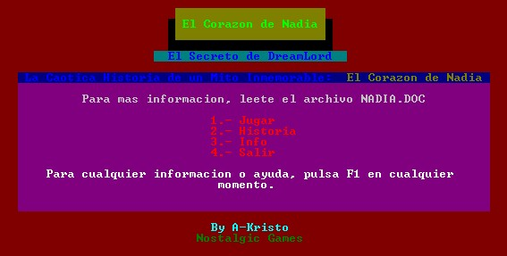

Unfinished projects with Turbo C 
================================= 
by [Joan Alba Maldonado](https://joanalbamaldonado.com/) (joanalbamaldonadoNO_SPAM_PLEASE AT gmail DOT com, without NO_SPAM_PLEASE)

Two unfinished games and an emulator prototype written in C language.

Version: different versions 
- Date: 1998 (approximately)

Description

Two unfinished games (not playable) and a Game Boy emulator prototype called AriGamBoy (not working) made with Borland Turbo C under MS-DOS 6.22.

The games are "Whisper in the Darkness" (includes story) and "El corazón de Nadia" (I lost the source code).